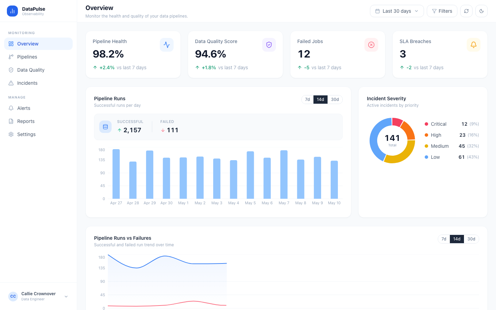
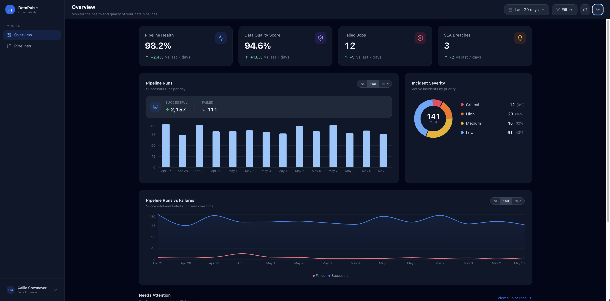
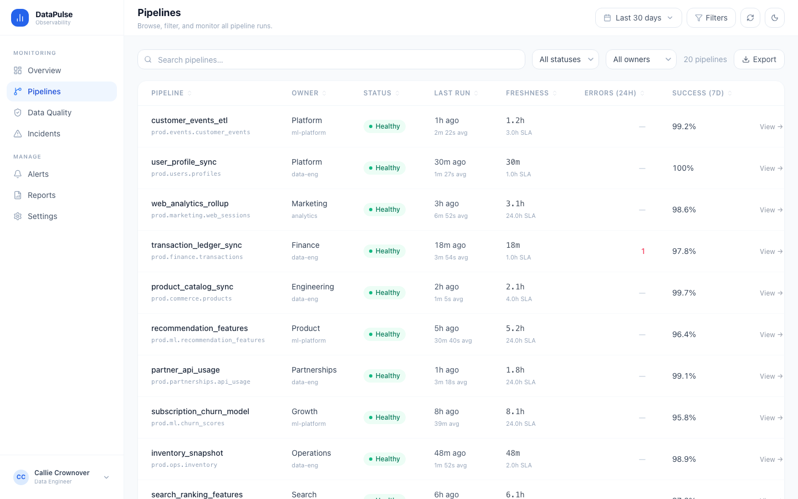
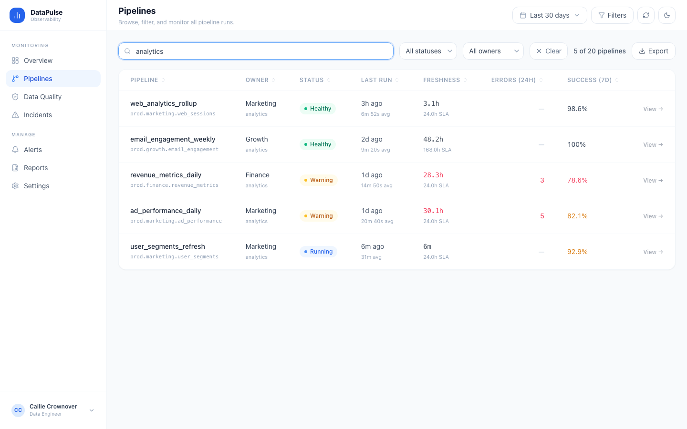
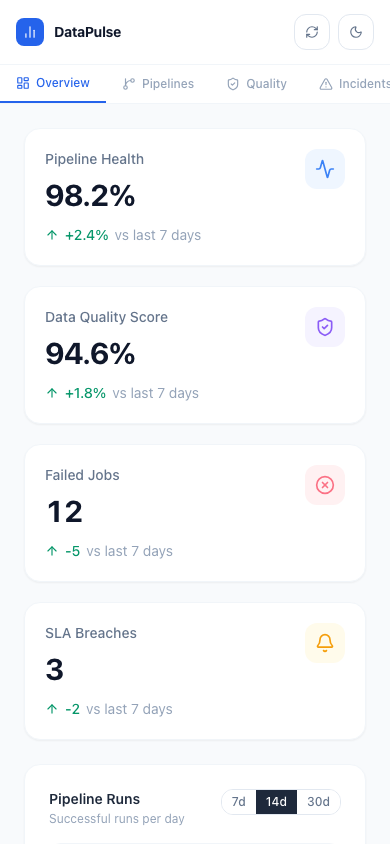
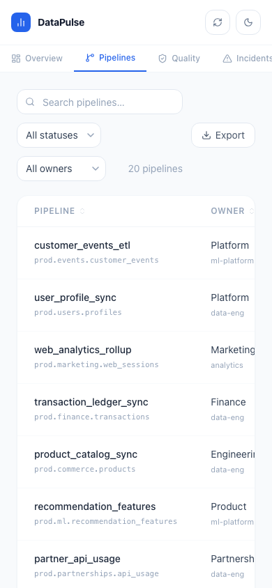
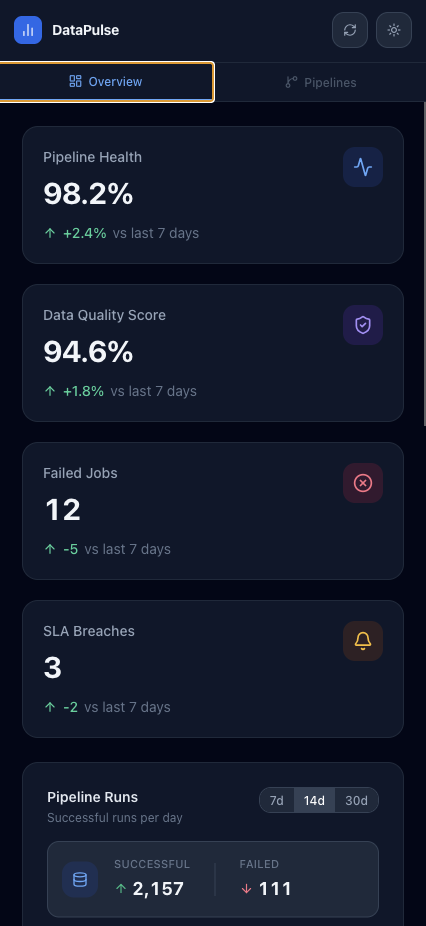

# Observe — Data Observability Dashboard

A clean, enterprise-grade dashboard for monitoring data pipeline health, freshness SLA compliance, and data quality. Built with React 19, TypeScript, Tailwind CSS, and Recharts.

## Screenshots

### Overview


### Overview — dark mode


### Pipelines


### Pipelines — active filter


### Mobile
| Overview | Pipelines | Dark |
|---|---|---|
|  |  |  |

---

## Features

- **Pipeline health overview** — four stat cards with week-over-week deltas (health %, quality score, failed jobs, SLA breaches)
- **Pipeline run trend** — stacked bar chart with configurable time range (7d / 14d / 30d) showing daily success and failure counts
- **Data freshness tracking** — area chart of average data age across all pipelines with a configurable SLA reference line
- **Needs attention** — Overview page surfaces only failed/warning pipelines so on-call engineers see issues immediately
- **Full pipeline table** — search + status + owner filters, sortable columns, pagination, CSV export of filtered results
- **Dark / light theme** — system preference on first load, toggled per-session, persisted to `localStorage`
- **Loading skeletons & error boundaries** — every data region degrades gracefully; errors show a retry button
- **Fake API layer** — deterministic generated data with simulated network delay; swap in a real API without touching UI components

## Tech stack

| Layer | Library |
|---|---|
| Framework | React 19 + TypeScript |
| Build tool | Vite 8 |
| Styling | Tailwind CSS 3 |
| Charts | Recharts 3 |
| Icons | Lucide React |

## Local development

### Prerequisites

- Node.js ≥ 18
- npm ≥ 9

### Setup

```bash
git clone https://github.com/<your-username>/ai-dashboard.git
cd ai-dashboard
npm install
```

### Environment variables

The app ships with a generated fake data layer — no API keys are needed to run it. If you want to connect a real backend later:

```bash
cp .env.example .env.local
# Edit .env.local and fill in your values
```

All browser-exposed variables must be prefixed with `VITE_`. See `.env.example` for documented options.

### Run

```bash
npm run dev        # development server at http://localhost:5173
npm run build      # production build → dist/
npm run preview    # preview the production build locally
```

## Deploying to Vercel

### Option A — Vercel dashboard (recommended for first deploy)

1. Push this repo to GitHub.
2. Go to [vercel.com/new](https://vercel.com/new) and click **Import Git Repository**.
3. Select your repo.
4. Vercel auto-detects Vite — the defaults are correct:
   - **Framework preset:** Vite
   - **Build command:** `npm run build`
   - **Output directory:** `dist`
   - **Install command:** `npm install`
5. If you have real environment variables, click **Environment Variables** and add them before deploying. Prefix all browser-facing keys with `VITE_`.
6. Click **Deploy**. Vercel will build and give you a `.vercel.app` URL.

Every push to `main` triggers a new production deploy automatically. Pull requests get isolated preview URLs.

### Option B — Vercel CLI

```bash
npm install -g vercel
vercel login
vercel          # deploys to a preview URL, walks you through project setup
vercel --prod   # promotes to production
```

### `vercel.json` explained

```json
{
  "rewrites": [{ "source": "/(.*)", "destination": "/index.html" }],
  "headers": [{ "source": "/assets/(.*)", "headers": [
    { "key": "Cache-Control", "value": "public, max-age=31536000, immutable" }
  ]}]
}
```

- **rewrites** — sends all routes to `index.html` so the SPA handles client-side navigation.
- **headers** — one-year immutable cache on hashed asset files (safe because Vite content-hashes all filenames).

## Project structure

```
src/
├── api/
│   ├── client.ts       # fakeFetch: configurable delay + optional error simulation
│   ├── data.ts         # Deterministic pipeline data generators (runs, freshness, stats)
│   └── endpoints.ts    # Typed API surface — swap implementations here for a real backend
├── components/
│   ├── charts/         # PipelineRunsChart (stacked bar), FreshnessChart (area + SLA line)
│   ├── filters/        # FilterBar — search, status select, owner select
│   ├── layout/         # Sidebar, Header (refresh + theme toggle)
│   ├── table/          # DataTable — sortable columns, pagination
│   └── ui/             # StatCard, StatusBadge, EmptyState, Skeleton primitives
├── hooks/
│   └── useAsync.ts     # Generic data-fetching hook: loading / data / error + refetch
├── pages/
│   ├── Overview.tsx    # Stat cards, charts, needs-attention table
│   └── Pipelines.tsx   # Full pipeline list with filters and CSV export
├── providers/
│   ├── ErrorBoundary.tsx  # Class component with retry UI
│   └── ThemeProvider.tsx  # dark/light context + localStorage persistence
├── types/index.ts      # Shared TypeScript types (Pipeline, FilterState, chart points, etc.)
└── utils/
    ├── cn.ts           # clsx wrapper for conditional Tailwind classes
    └── format.ts       # formatRelativeTime, formatDuration, formatFreshness, formatShortDate
```

## Connecting a real API

All data fetching flows through `src/api/endpoints.ts`. To swap the fake layer for a real one, replace the implementations there — the `useAsync` hook and all UI components are completely decoupled from the data source.

```ts
// src/api/endpoints.ts
export const api = {
  getPipelines: () =>
    fetch(`${import.meta.env.VITE_API_BASE_URL}/pipelines`).then((r) => r.json()),
  getDashboardStats: () =>
    fetch(`${import.meta.env.VITE_API_BASE_URL}/stats`).then((r) => r.json()),
  getPipelineRuns: (days = 30) =>
    fetch(`${import.meta.env.VITE_API_BASE_URL}/runs?days=${days}`).then((r) => r.json()),
  getFreshnessData: (days = 30) =>
    fetch(`${import.meta.env.VITE_API_BASE_URL}/freshness?days=${days}`).then((r) => r.json()),
}
```
